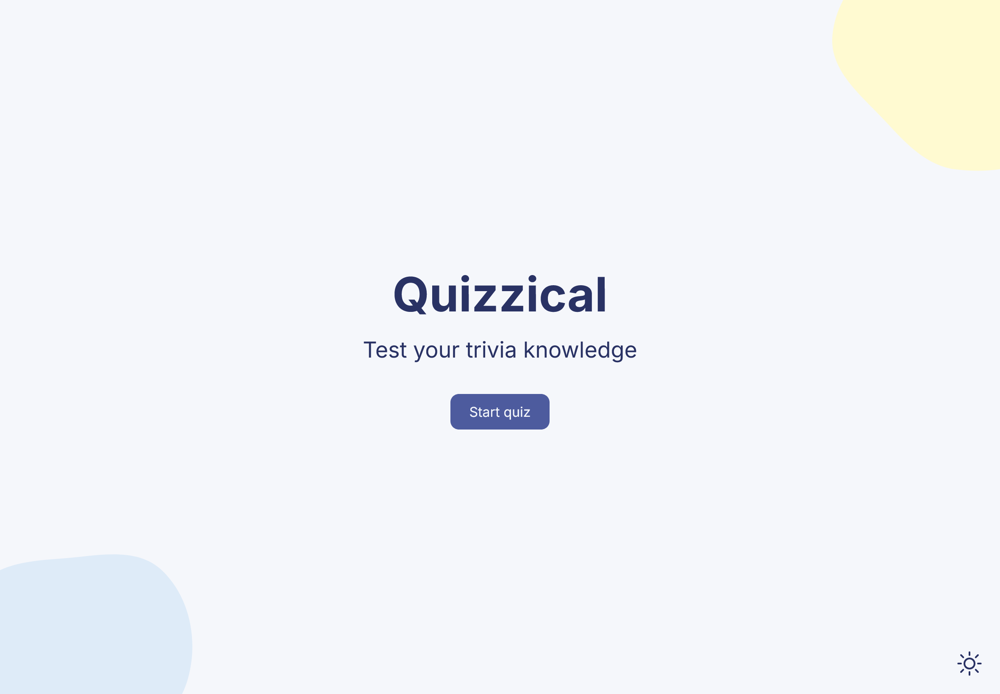
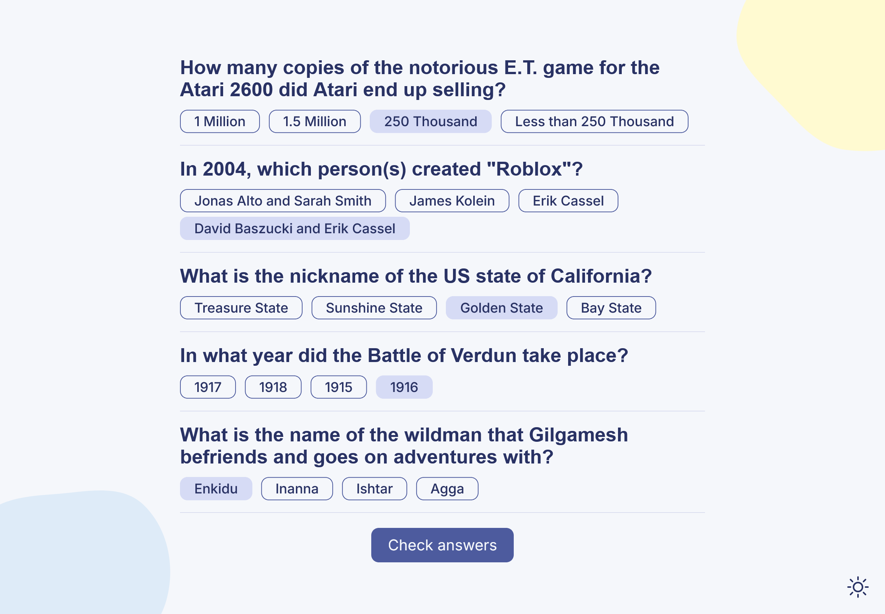
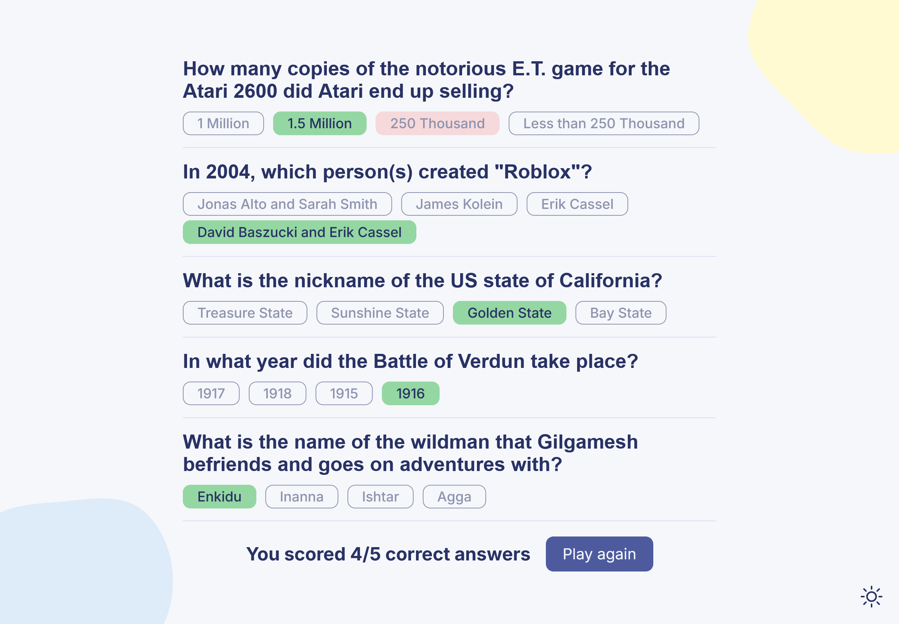
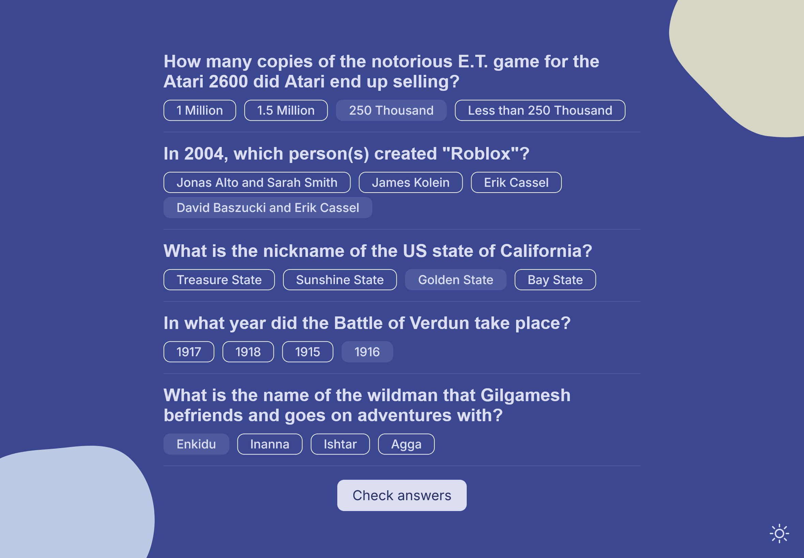
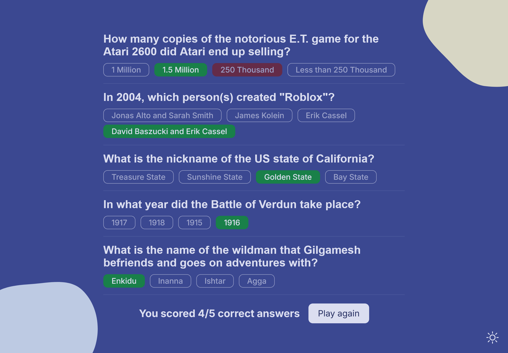
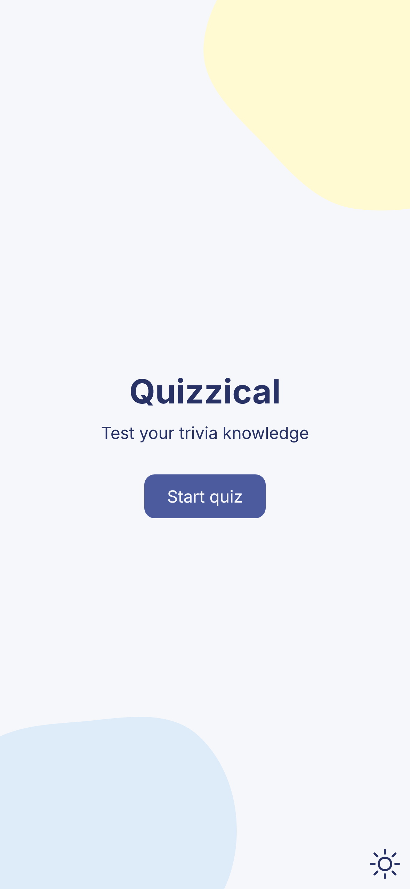
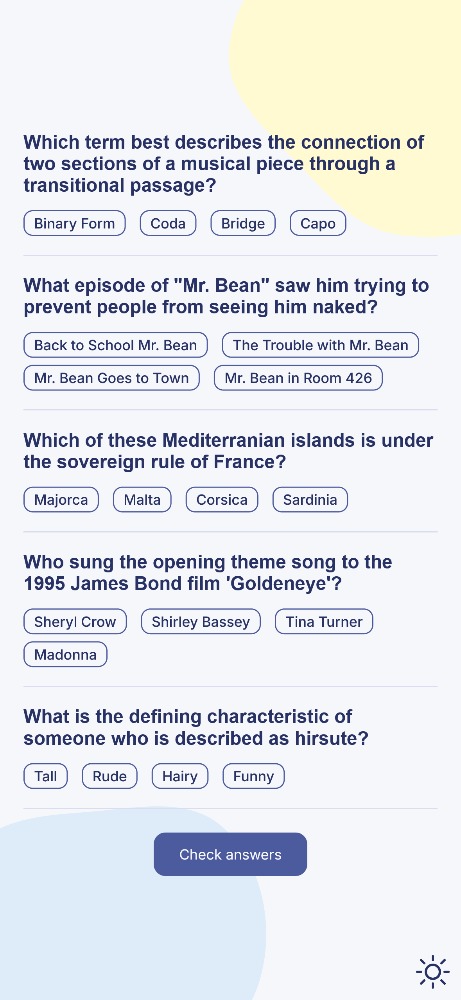
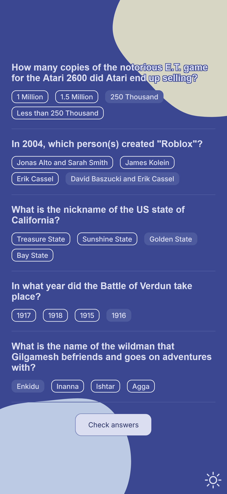
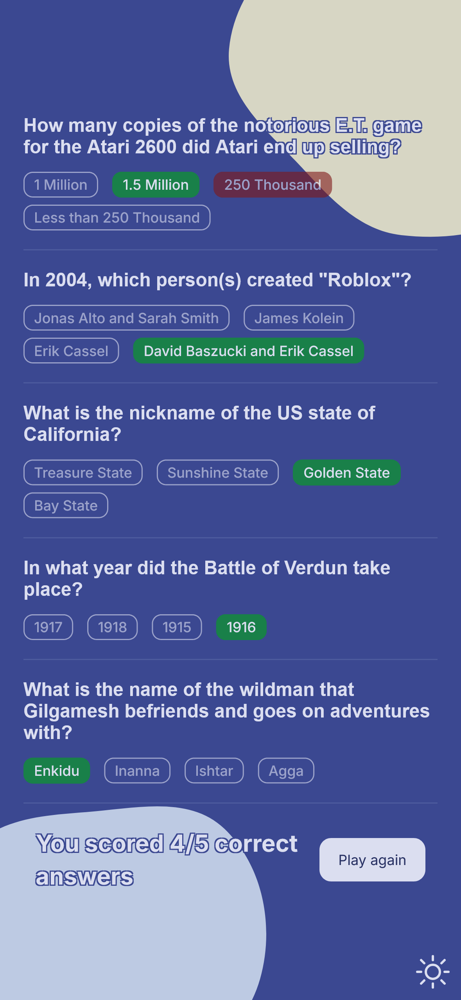

# ❓ Quizzical

A quiz minigame built with Next.js and using API of [Open Trivia Database](https://opentdb.com). Test your trivia knowledge, get your score, and try again with the new questions in the next rounds!

## Tech stack

* **React 19** - UI library
* **Next.js 16** (App Router) - server actions
* **TypeScript** - type safety
* **Tailwind CSS** - styling
* **Next Themes** - theme management

## Project structure

```
├── app/
│   ├── components/
│   │   ├── Background.tsx
│   │   ├── Landing.tsx      # Landing display
│   │   ├── Game.tsx         # Main game component
│   │   ├── Card.tsx         # Card component (question &
│   │   │                      possible answers)
│   │   ├── Answer.tsx       # Answer component with dynamic
│   │   │                      classes logic
│   │   └── ThemeSwitch.tsx  # Button for toggling themes
│   ├── lib/
│   │   ├── data.ts          # Server actions - token management,
│   │   │                      fetching data, checking answers
│   │   └── types.ts         # TypeScript types definitions
│   ├── svgs/                # Graphics for background & theme switch
│   ├── index.css            # Tailwind custom variables
│   ├── layout.tsx
│   ├── page.tsx             # Main game page
│   ├── loading.tsx
│   └── error.tsx
└── public/                  # Image assets
```

## Screenshots

<div>
    
    
</div>

<div>
    
</div>

<h3>Dark mode</h3>

<div>
    
    
</div>

<h3>Mobile viewport</h3>

<div>
    
    
    
    
</div>